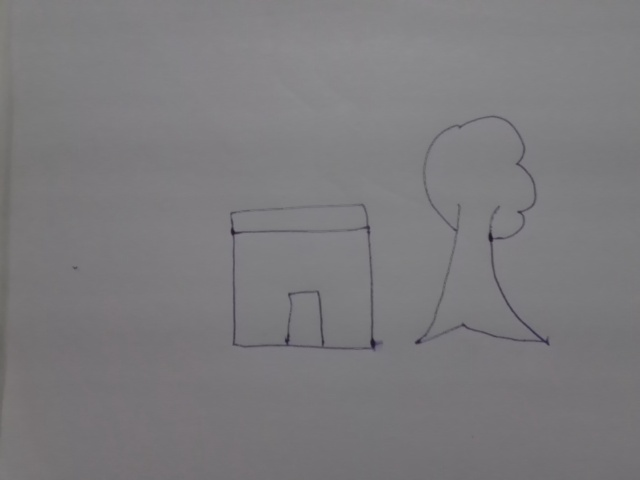
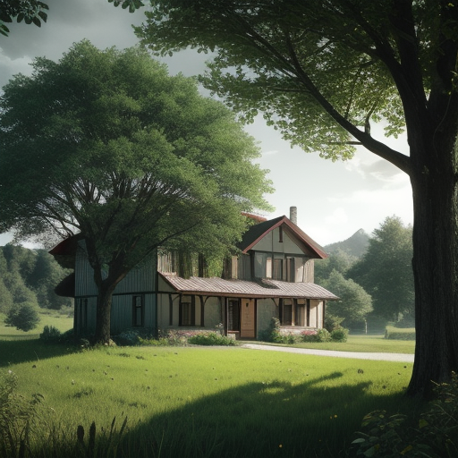

# 🎨 AI SketchVerse

> Transform simple whiteboard sketches into realistic AI-generated images using Computer Vision, Scene Understanding, and Stable Diffusion.


---

## 🚀 Overview

AI SketchVerse is an AI-powered sketch-to-image generation system that converts simple hand-drawn whiteboard sketches into realistic AI-generated images.

The system automatically detects sketch objects, understands the scene, generates a descriptive prompt, and produces a photorealistic image using Stable Diffusion through ComfyUI.

This project demonstrates the integration of Computer Vision, Scene Understanding, Prompt Engineering, and Generative AI into a complete end-to-end pipeline.

---

## ⭐ Key Achievement

Successfully built a complete:

```text
Sketch → Object Detection → Scene Understanding
→ Prompt Generation → Stable Diffusion → AI Image
```

pipeline capable of transforming simple sketches into realistic AI-generated artwork.

---

## 🏗️ System Architecture

```text
Whiteboard Sketch
        │
        ▼
Shape Detection (OpenCV)
        │
        ▼
Scene Understanding
        │
        ▼
Prompt Generation
        │
        ▼
ComfyUI API
        │
        ▼
Stable Diffusion
        │
        ▼
AI Generated Image
```

---

## 🎬 Demo Workflow

### Input Sketch



### Generated Output



---

## ✨ Features

* 🎯 Sketch Object Detection
* 🧠 Scene Understanding
* 📝 Automatic Prompt Generation
* 🎨 AI Image Generation
* ⚡ ComfyUI API Integration
* 🖼️ Stable Diffusion Based Rendering
* 🔄 End-to-End Automated Pipeline
* 🚀 GPU Accelerated Generation (RTX 4050)

---

## ⚙️ How It Works

### Step 1 — Draw a Sketch

Users draw simple shapes or objects on a whiteboard.

### Step 2 — Shape Detection

The system identifies shapes and contours using OpenCV.

Example:

```text
Square → House
Unknown Shape → Tree
```

### Step 3 — Scene Understanding

Detected objects are converted into scene elements.

Example:

```text
house
tree
```

### Step 4 — Prompt Generation

The system automatically generates a Stable Diffusion prompt.

Example:

```text
A beautiful countryside house with large green trees,
photorealistic, ultra detailed,
cinematic lighting, high quality, 8k
```

### Step 5 — AI Image Generation

ComfyUI and Stable Diffusion generate a realistic image from the prompt.

---

## 📊 Results

| Component                   | Status |
| --------------------------- | ------ |
| Shape Detection             | ✅      |
| Scene Understanding         | ✅      |
| Prompt Generation           | ✅      |
| ComfyUI Integration         | ✅      |
| Stable Diffusion Generation | ✅      |
| End-to-End Pipeline         | ✅      |

---

## 🛠️ Tech Stack

### Computer Vision

* OpenCV
* Contour Detection
* Shape Analysis

### Generative AI

* Stable Diffusion
* ComfyUI

### Backend

* Python
* Requests

### AI Pipeline

* Shape Detection
* Scene Understanding
* Prompt Engineering
* Image Generation

---

## 📂 Project Structure

```text
AI_SketchVerse/
│
├── main.py
├── shape_detector.py
├── scene_understanding.py
├── prompt_generator.py
├── generate_image.py
│
├── camera_capture.py
├── camera_detect.py
│
├── workflow_api.json
│
├── assets/
│   ├── input_sketch.png
│   └── output.png
│
├── README.md
└── .gitignore
```

---

## 🚀 Installation

### Clone Repository

```bash
git clone https://github.com/yourusername/AI-SketchVerse.git
cd AI-SketchVerse
```

### Create Virtual Environment

```bash
python -m venv venv
```

### Activate Environment

#### Windows

```bash
venv\Scripts\activate
```

### Install Dependencies

```bash
pip install opencv-python requests numpy
```

### Start ComfyUI

```bash
run_nvidia_gpu.bat
```

### Run Project

```bash
python main.py
```

---

## 🔮 Future Roadmap

* YOLO-Based Object Recognition
* CLIP-Based Scene Understanding
* Real-Time Camera Capture
* Multi-Object Scene Generation
* Web Application Interface
* Fine-Tuned Diffusion Models
* Sketch-to-3D Scene Generation

---

## 👨‍💻 Author

### Utkarsh Upadhyay

B.Tech Information Technology
Rajkiya Engineering College, Azamgarh

* SIH Grand Finalist
* AI & Computer Vision Enthusiast
* Full Stack Developer
* Machine Learning Practitioner

---

## 🌟 Support

If you found this project useful, consider giving it a ⭐ on GitHub.

It helps others discover the project and motivates future development.
